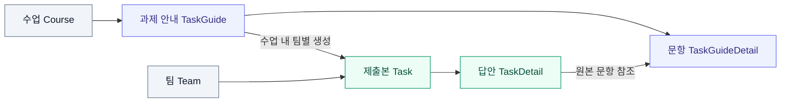
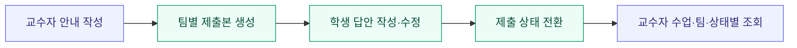

<div align="center">

<h1>Code-Codi</h1>
<p><strong>수업에서 시작해, 팀 협업과 과제 제출까지.</strong></p>
<p>교수자의 과제 안내와 학생 팀의 협업을 연결하는 백엔드</p>

<p>
  
  
  
  
  
</p>

<p><strong>Backend Portfolio</strong> · joamksh · 2025.05–2025.06</p>

<p>
  <a href="#overview">서비스 소개</a> ·
  <a href="#contributions">핵심 기여</a> ·
  <a href="#architecture">기술 구조</a> ·
  <a href="#api">API</a> ·
  <a href="#getting-started">실행 방법</a>
</p>

</div>

---

이 저장소는 팀 프로젝트를 fork한 **joamksh의 백엔드 포트폴리오**입니다. 서비스 전체 구조와 함께 직접 담당한 **회의록 관리, 교수자 과제 안내·배포, 팀별 과제 제출**의 설계와 구현 과정을 정리했습니다.

| 01 · 과제 배포 | 02 · 팀별 제출 | 03 · 회의록 편집 |
| :--- | :--- | :--- |
| **공통 안내와 제출본 분리** | **작성부터 교수자 확인까지** | **항목별 편집과 참석자 연결** |
| 수업의 각 팀에 제출 양식 생성 | 답안 수정·제출 상태·조건별 조회 | 안건·내용·결정사항 개별 관리 |
| [설계 살펴보기 ↓](#assignment-distribution) | [제출 흐름 살펴보기 ↓](#submission-flow) | [구조 개선 살펴보기 ↓](#meeting-design) |

<a id="overview"></a>

## 서비스 소개

교수자는 수업 단위로 과제와 문항을 작성하고, 학생은 소속 팀의 제출본에 답안을 작성합니다. 팀의 작업 진행 상황과 협업 기록은 칸반·일정·회의록으로 관리합니다.

> **서비스 흐름**　수업·팀 구성 → 팀 협업 → 교수자 과제 배포 → 학생 답안 제출 → 교수자 확인

<details>
<summary><strong>전체 서비스 기능과 개인 담당 범위 보기</strong></summary>

| 기능 | 주요 내용 | joamksh 담당 범위 |
| --- | --- | --- |
| 회원 | 회원가입, 세션 로그인·로그아웃, 탈퇴, 학생/교수자 구분 | 역할 Enum 및 회원가입 역할 저장 연동 |
| 수업·팀 | 수업 목록, 팀 생성·수정, 팀원 관리 | 수업별 팀 조회, 참석자 선택용 팀원 조회 |
| 칸반 | 팀별 작업의 상태·담당자·우선순위·기한 관리 | — |
| 일정 | 팀 일정 CRUD, 월별 조회 | — |
| 회의록 | 회의 정보, 안건, 세부 내용, 결정사항, 참석자 관리 | **핵심 구현 담당** |
| 과제 안내 | 교수자의 안내·문항 작성 및 수업별 팀 배포 | **핵심 구현 담당** |
| 과제 제출 | 팀별 답안 수정, 제출 상태 관리, 교수자 확인 목록 | **핵심 구현 담당** |
| 게시판 | 공유/가이드 글, 댓글, 좋아요, 조회 수, 이미지 업로드 | — |

`—`는 팀 전체 기능 중 개인 핵심 기여로 소개하지 않는 영역입니다. 담당 범위는 비병합 커밋의 실제 변경 사항을 기준으로 구분했습니다.

</details>

---

<a id="contributions"></a>

## 핵심 기여

기능을 구현하면서 다룬 요구사항과 데이터 구조, 실제 동작을 중심으로 정리했습니다. 각 항목에서 코드와 변경 커밋을 확인할 수 있습니다.

<a id="assignment-distribution"></a>

### 01 · 하나의 과제 안내, 팀마다 독립적인 제출본

**요구사항**

하나의 과제 안내를 여러 팀이 공유하면서도 답안과 제출 상태는 팀별로 독립적으로 관리해야 했습니다.

**설계와 구현**

- `TaskGuide`와 `TaskGuideDetail`에 교수자의 과제 제목·마감일·문항 정보를 저장했습니다.
- `Task`와 `TaskDetail`에 팀별 제출 상태와 답안을 저장하고, 원본 안내·문항을 참조하도록 연결했습니다.
- 안내의 소속을 수업(`Course`)에 연결하고, 배포 요청 시 해당 수업의 팀마다 제출본과 빈 답안을 생성했습니다.
- 배포 처리에 트랜잭션을 적용하고, 배포 완료 상태의 안내에 다시 생성 요청이 들어오면 예외로 처리했습니다.



**구현 결과**

교수자가 안내를 한 번 작성하면 배포 시점의 각 팀에 동일한 문항 구성의 제출 양식을 생성할 수 있습니다. 안내와 팀별 답안의 역할을 분리해, 학생 화면에서 공통 문항 설명과 해당 팀의 답안을 함께 조회하도록 구성했습니다.

예를 들어 수업에 5개 팀과 3개 문항이 있다면 제출본 5개와 빈 답안 15개가 생성되는 구조입니다. 이 숫자는 동작 설명을 위한 예시입니다.

[배포 로직](src/main/java/com/codiapp/codi/domain/taskGuide/service/TaskGuideCommandServiceImpl.java) · [안내 엔티티](src/main/java/com/codiapp/codi/domain/taskGuide/entity/TaskGuide.java) · [구현 커밋 747814e](https://github.com/joamksh/Code-Codi-Be/commit/747814e)

---

<a id="submission-flow"></a>

### 02 · 답안 작성부터 교수자 확인까지 이어지는 흐름

**요구사항**

학생에게는 팀의 과제와 답안을 편집하는 기능이, 교수자에게는 수업·팀별 제출 상태를 확인하는 기능이 필요했습니다.

**설계와 구현**

- 팀 ID를 기준으로 과제 목록을 조회하고 페이지 처리를 적용했습니다.
- 안내·문항 설명·학생 답안을 조합한 상세 응답 DTO를 구성했습니다.
- 답안 ID와 내용을 매핑해 해당 과제에 속한 답안들을 수정하도록 구현했습니다.
- `IN_PROGRESS ↔ COMPLETE` 상태 전환과 제출 날짜 기록·초기화를 연결했습니다.
- 교수자 확인용 목록에 수업 ID·팀 ID·제출 상태 조건과 페이지 처리를 적용했습니다.



**구현 결과**

과제 배포 이후 학생의 답안 저장과 제출, 교수자의 제출 내역 확인을 하나의 데이터 흐름으로 연결했습니다. 제출 완료 시 현재 날짜를 기록하고, 제출 전 상태로 되돌리면 날짜를 비우도록 구현했습니다.

[제출 상태 처리](src/main/java/com/codiapp/codi/domain/task/service/TaskCommandServiceImpl.java) · [답안 응답·수정 처리](src/main/java/com/codiapp/codi/domain/task/converter/TaskConverter.java) · [제출 상태 커밋 b3a0e61](https://github.com/joamksh/Code-Codi-Be/commit/b3a0e61) · [교수자 조회 커밋 7f053d4](https://github.com/joamksh/Code-Codi-Be/commit/7f053d4)

---

<a id="meeting-design"></a>

### 03 · 회의록 전체 수정에서 항목별 편집으로

**개선 배경**

초기에는 회의록과 하위 내용을 함께 처리했습니다. 회의 중 안건이나 결정사항 하나만 추가·수정하는 동작을 지원하기 위해 편집 단위를 나눴습니다.

| 개선 전 | 개선 후 |
| :--- | :--- |
| 회의록과 하위 내용을 함께 처리 | 안건·세부 내용·결정사항별 API 분리 |
| 항목별 편집을 위한 식별 정보 보완 필요 | 상세 응답의 항목 ID를 수정·삭제에 활용 |
| 수정 응답에 엔티티 반환 | 상세 응답 DTO로 변환 |

**설계와 구현**

- `Meeting → Agenda → AgendaDetail`, `Meeting → Decision` 관계로 회의 내용을 모델링했습니다.
- 안건·세부 내용·결정사항 각각의 생성·수정·삭제 API와 서비스를 분리했습니다.
- 상세 응답에 하위 항목 ID를 포함해 화면에서 편집 대상을 식별하도록 했습니다.
- 수정 API가 엔티티 대신 DTO를 반환하도록 변경하고, 날짜 문자열 파싱과 형식 오류 처리를 보강했습니다.
- 팀별 회의록 목록과 페이지 처리를 구현했습니다.

**구현 결과**

회의 기본 정보와 하위 항목을 각각의 API로 편집할 수 있게 했습니다. 조회 응답의 ID를 후속 수정·삭제 요청에 사용할 수 있도록 요청과 응답 구조를 연결했습니다.

[하위 항목 API](src/main/java/com/codiapp/codi/domain/meeting/controller/MeetingSubItemController.java) · [회의록 응답 변환](src/main/java/com/codiapp/codi/domain/meeting/converter/MeetingConverter.java) · [구조 개선 커밋 ab8497a](https://github.com/joamksh/Code-Codi-Be/commit/ab8497a)

<details>
<summary><strong>04 · 팀 소속 정보와 회의 참석자 관리 연동</strong></summary>

- `MeetingAttendee`가 회의와 `UserTeam`을 참조하도록 설계했습니다.
- 팀원 선택에 필요한 `userTeamId`와 사용자 이름 조회 API를 추가했습니다.
- 회의별 참석자 저장·조회·수정을 구현했습니다. 수정은 기존 참석자 연결을 삭제한 뒤 새 목록을 저장하는 방식입니다.
- 회의록 목록 응답에 참석자 이름을 포함했습니다.

팀 소속 정보와 참석 기록을 연결해, 회의별 참석자를 저장하고 다시 조회·수정할 수 있도록 구현했습니다.

[참석자 처리](src/main/java/com/codiapp/codi/domain/meeting/service/MeetingAttendeeCommandServiceImpl.java) · [참석자 엔티티](src/main/java/com/codiapp/codi/domain/meeting/entity/MeetingAttendee.java) · [구현 커밋 90c0180](https://github.com/joamksh/Code-Codi-Be/commit/90c0180)

</details>

<details>
<summary><strong>05 · 초기 개발 기반 정리와 도메인 변경 책임 개선</strong></summary>

- Spring Boot·Gradle 기반과 기능별 패키지 예시를 구성했습니다.
- 과제의 변경 로직을 Converter에서 `Task.applyUpdate()`로 이동해 데이터 변환과 상태 변경의 책임을 구분했습니다.
- 담당 기능에서 조회 서비스와 변경 서비스를 나누고, 변경 작업에 트랜잭션과 JPA 변경 감지를 활용했습니다.
- 담당 도메인의 예외 코드·핸들러, Swagger 설명, DTO와 URL을 보완했습니다.
- 학생/교수자 역할 Enum을 회원가입 데이터와 연결하고, 과제·회의 기능에 필요한 팀 조회 API를 확장했습니다.

[엔티티 변경 로직](src/main/java/com/codiapp/codi/domain/task/entity/Task.java) · [리팩터링 커밋 758d03b](https://github.com/joamksh/Code-Codi-Be/commit/758d03b) · [역할 구분 커밋 1a46a5f](https://github.com/joamksh/Code-Codi-Be/commit/1a46a5f)

</details>

---

<a id="architecture"></a>

## 기술 구성과 프로젝트 구조

| 구분 | 기술 및 용도 |
| --- | --- |
| 언어·프레임워크 | Java 17, Spring Boot 3.4.1, Spring Web |
| 데이터 접근 | Spring Data JPA, Hibernate, Oracle JDBC |
| 회원 기능 | Spring Security, BCrypt, HttpSession |
| 검증·문서화 | Bean Validation, springdoc OpenAPI 2.7.0 |
| 개발 도구 | Gradle Wrapper 8.13, Lombok |

<details>
<summary><strong>패키지 구조와 계층별 역할 보기</strong></summary>

```text
src/main/java/com/codiapp/codi
├── domain
│   ├── user / course / team     회원·수업·팀
│   ├── project / schedule      칸반·일정
│   ├── meeting                 회의록·참석자
│   ├── taskGuide               교수자 과제 안내
│   ├── task                    팀별 제출본·답안
│   └── board                   게시판·댓글
└── global
    ├── apiPayload              공통 응답·예외 처리
    ├── common                  공통 엔티티
    └── config                  웹·보안·Swagger 설정
```

도메인 내부는 주로 `Controller → Service → Repository`로 구성하고 DTO·Converter를 통해 데이터를 전달합니다. 회의록·과제·과제 안내 등은 Command/Query 서비스를 구분합니다. 공통 응답·예외 처리 기반과 Swagger 초기 설정은 팀원이 구현했으며, 담당 기능에 맞게 확장했습니다.

</details>

<a id="api"></a>

## 주요 API

전체 명세는 애플리케이션 실행 후 Swagger UI에서 확인할 수 있습니다. 아래는 개인 담당 기능의 대표 API입니다.

<details>
<summary><strong>과제·회의록 API 목록 보기</strong></summary>

| 기능 | Method | 경로 |
| --- | --- | --- |
| 수업별 과제 안내 목록 | GET | `/taskGuide?courseId={courseId}` |
| 과제 안내 생성 | POST | `/taskGuide` |
| 팀별 제출본 생성 | POST | `/taskGuide/{id}/generateTasks` |
| 팀별 과제 목록 | GET | `/tasks?teamId={teamId}` |
| 안내·답안 통합 조회 | GET | `/tasks/final/{taskId}` |
| 답안 수정 | PATCH | `/tasks/final/{taskId}` |
| 제출 상태 전환 | PATCH | `/tasks/{taskId}/status` |
| 교수자 확인 목록 | GET | `/tasks/teamTasks?courseId={courseId}&teamId={teamId}&status=COMPLETE` |
| 팀별 회의록 목록 | GET | `/meeting?teamId={teamId}` |
| 회의록 생성 | POST | `/meeting` |
| 회의 안건 수정 | PATCH | `/meeting/item/agenda/{agendaId}` |
| 참석자 조회 | GET | `/meeting/item/{meetingId}/attendees` |
| 참석자 교체 | PATCH | `/meeting/item/attendees` |

</details>

<a id="getting-started"></a>

## 로컬 실행

**준비 사항:** JDK 17, 접근 가능한 Oracle DB, 엔티티에 맞는 스키마가 필요합니다. 현재 설정은 `ddl-auto=none`이며 저장소에 DB 초기화 SQL은 포함되어 있지 않습니다.

```bash
git clone https://github.com/joamksh/Code-Codi-Be.git
cd Code-Codi-Be
```

DB 접속 정보는 실행 환경의 환경 변수로 지정할 수 있습니다. 아래 값은 본인의 개발용 DB 정보로 변경합니다.

<details>
<summary><strong>Windows · PowerShell</strong></summary>

```powershell
# Windows PowerShell
$env:SPRING_DATASOURCE_URL = 'jdbc:oracle:thin:@//localhost:1521/YOUR_SERVICE_NAME'
$env:SPRING_DATASOURCE_USERNAME = 'YOUR_DB_USERNAME'
$env:SPRING_DATASOURCE_PASSWORD = 'YOUR_DB_PASSWORD'
.\gradlew.bat bootRun
```

</details>

<details>
<summary><strong>macOS · Linux</strong></summary>

```bash
# macOS / Linux
export SPRING_DATASOURCE_URL='jdbc:oracle:thin:@//localhost:1521/YOUR_SERVICE_NAME'
export SPRING_DATASOURCE_USERNAME='YOUR_DB_USERNAME'
export SPRING_DATASOURCE_PASSWORD='YOUR_DB_PASSWORD'
bash ./gradlew bootRun
```

</details>

- Swagger UI: [http://localhost:8080/swagger-ui.html](http://localhost:8080/swagger-ui.html)
- OpenAPI: [http://localhost:8080/v3/api-docs](http://localhost:8080/v3/api-docs)
- 현재 프런트엔드 CORS 허용 주소: `http://localhost:3000`

## 후속 개선 과제

현재 구현을 바탕으로 다음 항목을 확장할 수 있습니다.

- **과제 배포 동시성:** 현재 상태 검사에 더해 동시 배포 요청에서도 중복 생성되지 않도록 제약과 동시성 제어 보강
- **역할·소속 검증:** 사용자 역할 및 요청자의 팀·수업 소속에 따른 API 접근 검증 강화
- **시나리오 테스트:** 과제 배포·제출 상태 전환·참석자 교체를 검증하는 서비스/통합 테스트 추가
- **실행 재현성:** DB 초기화·마이그레이션 스크립트와 개발 환경 구성 추가

현재 테스트 소스는 기본 `contextLoads` 중심이며, README 작성 과정에서 애플리케이션 실행 및 DB 연동을 재검증하지 않았습니다.

## 작업 이력

주요 기여 기간은 **2025.05.14–2025.06.19**입니다. 초기 모델과 CRUD를 구현한 뒤 항목별 편집 구조를 개선하고, 수업·팀·사용자와 연결해 과제 배포·제출 및 참석자 관리로 확장했습니다.

| 5월 중순 | 5월 하순 | 6월 초·중순 | 6월 18–19일 |
| :--- | :--- | :--- | :--- |
| **기반 구현** | **편집 구조 개선** | **도메인 연동** | **제출 흐름 확장** |
| 초기 구조·회의록·과제 CRUD | 항목별 편집·DTO·변경 책임 | 팀별 조회·사용자 역할 | 과제 배포·제출·참석자 |

상세 담당 범위, 변경 과정, 근거 커밋은 [프로젝트 및 개인 작업 이력 분석](docs/project-and-joamksh-history.md)에 정리했습니다. 이 문서의 구현 설명은 팀 개발 이력이 반영된 `04df469` 기준입니다.
